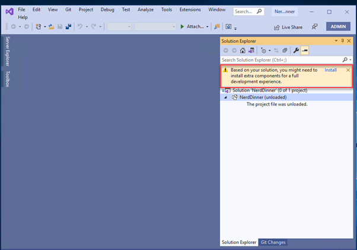

## Setting up the Environment
1. Login to the Virtual Machine using the Lab VM details from the Lab Environment output page.

    

1. Clone the application repo from [https://github.com/spboyer/nerddinner-mvc4](https://github.com/spboyer/nerddinner-mvc4) in the VM provided to you and open the solution in Visual Studio 2019. Click on Install to get dependencies installed.

     

2. Rebuild the solution and run the application locally to ensure that the application is working fine. The application looks like as shown in the below figure.

   

